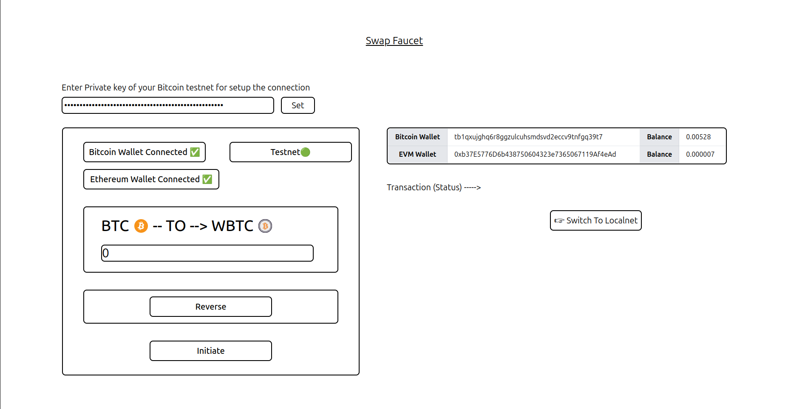

# <h1 align="center">Swap Faucet</h1>

<p align="center">
  
</p>


<p align="center">Welcome to the Swap Faucet, your go-to solution for developers in need of test tokens. This platform allows you to effortlessly swap or transfer test tokens between the Bitcoin testnet and the Ethereum Sepolia testnet, using your existing tokens on either network.</p>

# Index

- [Swap Faucet](#swap-faucet)
- [Index](#index)
- [Introduction](#introduction)
  - [Techstack](#techstack)
- [How to setup](#how-to-setup)
  - [Clone the repo](#clone-the-repo)
  - [Install dependencies](#install-dependencies)
- [Finally run the webapp](#finally-run-the-webapp)
- [License](#license)

# Introduction

Create a testnet faucet for developers who lack test tokens. This faucet allows them to swap or transfer test tokens between the Bitcoin testnet and the Ethereum Sepolia testnet, and vice versa, using their existing test tokens on either network.

## Techstack
     
    - Vite + ReactJS with Javascript
    - TailwindCSS
    - Garden SDK
    - Ethers

# How to setup
## Clone the repo

Fork and clone the repo

```bash
git clone git@github.com:AAshu1412/garden-swap.git
cd garden-swap
```

## Install dependencies

```bash
npm install
```


# Finally run the webapp

```bash
npm run dev
```

The webapp will be running on `localhost:5173`

To open the same application of another device for testing purposes, make sure that the device is connected to the same network as the device on which the webapp is running. Then visit `http://<IP_ADDRESS_OF_THE_DEVICE_RUNNING_THE_WEBAPP>:5173`

# License

The projects is licensed under [MIT](https://choosealicense.com/licenses/mit/)